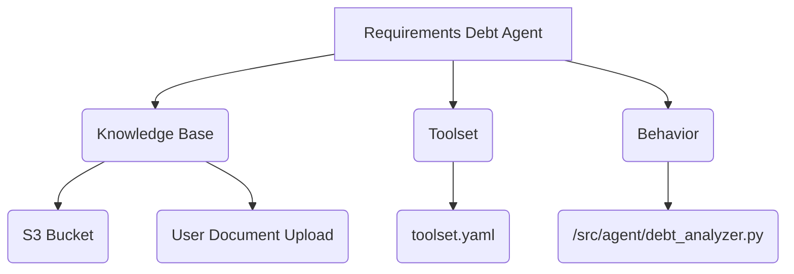
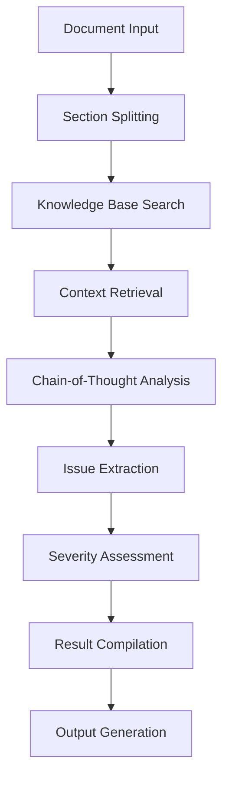
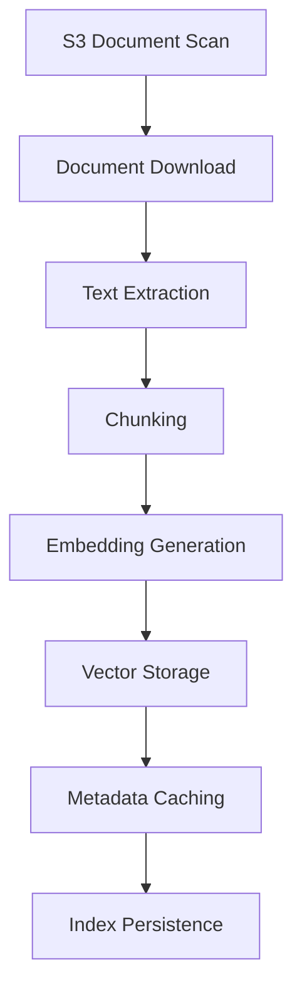

# SEMP Requirements Debt Analyzer - Technical Report

**Document Version:** 1.0  
**Date:** September 30, 2025  
**Author:** Krish Patel

## Executive Summary

The SEMP Requirements Debt Analyzer is a proof-of-concept intelligent agent system designed to automatically identify, analyze, and provide recommendations for Requirements Debt (RQ Debt) in Systems Engineering Management Plans (SEMPs). The system leverages advanced Large Language Model (LLM) capabilities through AWS Bedrock, implements Retrieval-Augmented Generation (RAG) architecture, and provides both command-line and interactive chat interfaces.

This report provides a comprehensive technical analysis of the system's architecture, implementation, data flow, and deployment considerations.

---

## 1. System Architecture Overview

### 1.1 High-Level Architecture

The system follows a layered architecture pattern with four distinct tiers:

```
┌─────────────────────────────────────────────────────────────┐
│                    Presentation Layer                        │
│                  (CLI + Rich Console)                       │
├─────────────────────────────────────────────────────────────┤
│                     Agent Layer                             │
│  ┌─────────────────────┐  ┌─────────────────────────────────┤
│  │ Requirements Debt   │  │    Session Manager              │
│  │     Analyzer        │  │   (Chat History)               │
│  └─────────────────────┘  └─────────────────────────────────┤
├─────────────────────────────────────────────────────────────┤
│                     RAG Layer                               │
│  ┌─────────────────────┐  ┌─────────────────────────────────┤
│  │ Knowledge Base      │  │  Document Processor             │
│  │ (FAISS + Bedrock)   │  │  (PDF/DOCX/MD/TXT/JSON)        │
│  └─────────────────────┘  └─────────────────────────────────┤
├─────────────────────────────────────────────────────────────┤
│                 Infrastructure Layer                        │
│  ┌─────────────────────┐  ┌─────────────────────────────────┤
│  │  S3 Knowledge Base  │  │   DynamoDB Chat Storage        │
│  │     (Documents)     │  │   (Sessions & History)         │
│  └─────────────────────┘  └─────────────────────────────────┤
└─────────────────────────────────────────────────────────────┘
```

### 1.2 Core Components

#### 1.2.1 Agent Layer
- **Requirements Debt Analyzer** (`src/agent/debt_analyzer.py`): Core AI agent implementing chain-of-thought reasoning
- **Session Manager** (`src/agent/session_manager.py`): Manages conversational state and context

#### 1.2.2 RAG Layer
- **Knowledge Base** (`src/rag/knowledge_base.py`): RAG implementation with vector similarity search
- **Document Processor** (`src/rag/document_processor.py`): Multi-format document parsing
- **Vector Store** (`src/rag/vector_store.py`): FAISS-based vector database

#### 1.2.3 Infrastructure Layer
- **Bedrock Client** (`src/infrastructure/bedrock_client.py`): AWS Bedrock LLM interface
- **S3 Client** (`src/infrastructure/s3_client.py`): Knowledge base document storage
- **DynamoDB Client** (`src/infrastructure/dynamodb_client.py`): Session and chat persistence


### 1.3 Agent Overview

---

## 2. Data Models and Domain Logic

### 2.1 Core Data Models (`src/models/debt_models.py`)

#### 2.1.1 Requirements Debt Classification

```python
class DebtType(str, Enum):
    AMBIGUITY = "Ambiguity"
    INCOMPLETENESS = "Incompleteness"  
    INCONSISTENCY = "Inconsistency"
    TRACEABILITY_GAP = "Traceability Gap"
    VAGUE_TERMINOLOGY = "Vague Terminology"
    MISSING_CONSTRAINTS = "Missing Constraints"
    UNCLEAR_ACCEPTANCE_CRITERIA = "Unclear Acceptance Criteria"
    CONFLICTING_REQUIREMENTS = "Conflicting Requirements"
    OUTDATED_REQUIREMENTS = "Outdated Requirements"
    UNTESTABLE_REQUIREMENTS = "Untestable Requirements"
```

This enumeration defines the ten primary types of requirements debt the system can identify, based on established systems engineering best practices.

#### 2.1.2 Debt Issue Structure

```python
class DebtIssue(BaseModel):
    id: str                          # Unique identifier
    location_in_text: str           # Exact location in document
    debt_type: DebtType             # Classification of debt
    problem_description: str        # Detailed problem analysis
    recommended_fix: str            # Actionable improvement recommendation
    reference: str                  # Knowledge base citation
    severity: SeverityLevel         # Impact assessment (Low/Medium/High/Critical)
    confidence: float               # Detection confidence (0.0-1.0)
```

#### 2.1.3 Analysis Result Model

The `AnalysisResult` class encapsulates complete document analysis outcomes, including:
- Individual debt issues list
- Statistical summaries
- Severity and debt type distributions
- Analysis metadata (duration, version, timestamp)

### 2.2 Chain-of-Thought Reasoning Models

The system implements structured reasoning through:
- `ChainOfThoughtStep`: Individual reasoning steps with evidence
- `ChainOfThoughtAnalysis`: Complete reasoning chains for debt detection
- `KnowledgeBaseReference`: Authoritative source citations

---

## 3. Requirements Debt Detection Engine

### 3.1 Core Analysis Algorithm (`RequirementsDebtAnalyzer`)

The analysis engine implements a sophisticated multi-stage process:

#### Stage 1: Document Decomposition
```python
def _split_document_into_sections(self, content: str) -> Dict[str, str]:
```
- Uses regex pattern matching to identify numbered sections
- Falls back to chunking for unstructured documents
- Maintains document context for accurate issue location

#### Stage 2: Knowledge Base Context Retrieval
```python
def _get_relevant_context(self, content: str, section_name: str) -> List[Dict]:
```
- Performs semantic search across curated SEMP knowledge base
- Generates multiple search queries for comprehensive coverage
- Deduplicates results and ranks by relevance score

#### Stage 3: Chain-of-Thought Analysis
```python
def _perform_chain_of_thought_analysis(self, content: str, section_name: str, context: List[Dict]) -> Dict[str, Any]:
```
- Constructs detailed prompts with context and instructions
- Invokes AWS Bedrock Claude model for structured reasoning
- Implements JSON response parsing with error recovery

#### Stage 4: Issue Extraction and Validation
```python
def _extract_issues_from_analysis(self, analysis: Dict[str, Any], content: str, section_name: str, context: List[Dict]) -> List[DebtIssue]:
```
- Parses structured LLM output into domain objects
- Validates severity levels and confidence scores
- Associates knowledge base references with high-relevance citations

### 3.2 Prompt Engineering Strategy

The system uses sophisticated prompt templates:

#### System Prompt Design
- Establishes expert role in Requirements and Systems Engineering
- Defines structured output format requirements
- Specifies evaluation criteria and best practices

#### User Prompt Construction
- Includes document section and context
- Provides knowledge base references
- Requests chain-of-thought reasoning
- Specifies output format and severity assessment

---

## 4. Retrieval-Augmented Generation (RAG) Implementation

### 4.1 Knowledge Base Architecture (`SEMPKnowledgeBase`)

#### 4.1.1 Document Processing Pipeline
1. **Document Discovery**: S3 bucket scanning for supported formats
2. **Content Extraction**: Multi-format parsing (PDF, DOCX, Markdown, TXT, JSON)
3. **Text Chunking**: Semantic chunking with overlap for context preservation
4. **Embedding Generation**: AWS Bedrock Titan v2 embeddings (1024 dimensions)
5. **Vector Storage**: FAISS indexing for similarity search
6. **Metadata Caching**: Document metadata and processing state persistence

#### 4.1.2 Vector Store Implementation (`SimpleVectorStore`)
```python
class SimpleVectorStore:
    def __init__(self, dimension: int = 1024, storage_path: str = None):
        self.dimension = dimension
        self.index = faiss.IndexFlatIP(dimension)  # Inner product similarity
```
- Uses FAISS IndexFlatIP for cosine similarity search
- Maintains metadata mapping for chunk context
- Implements persistent storage for index and metadata

#### 4.1.3 Search Algorithm
```python
def search(self, query_embedding: np.ndarray, top_k: int = 5, score_threshold: float = 0.7) -> List[Dict]:
```
- Performs similarity search with configurable thresholds
- Returns ranked results with relevance scores
- Filters results below minimum relevance threshold

### 4.2 Document Processing Strategy

#### Multi-Format Support
- **PDF**: PyPDF2 text extraction with fallback handling
- **DOCX**: Python-docx native parsing
- **Markdown**: Direct text processing with header preservation
- **TXT**: UTF-8 text reading with encoding detection
- **JSON**: Structured data flattening to readable text

#### Text Chunking Algorithm
- Configurable chunk size (default: 1000 characters)
- Overlap preservation (default: 200 characters)
- Semantic boundary respect for coherent chunks

---

## 5. Infrastructure and Cloud Integration

### 5.1 AWS Bedrock Integration (`BedrockClient`)

#### 5.1.1 Model Support
- **Primary LLM**: Anthropic Claude 3 Sonnet (anthropic.claude-3-sonnet-20240229-v1:0)
- **Embeddings**: Amazon Titan Embed Text v1 (amazon.titan-embed-text-v1)
- **Fallback**: Amazon Titan models for text generation

#### 5.1.2 Request/Response Handling
```python
def _build_claude_request(self, prompt: str, system_prompt: str, params: Dict) -> Dict:
    return {
        "anthropic_version": "bedrock-2023-05-31",
        "max_tokens": params["max_tokens"],
        "temperature": params["temperature"],
        "top_p": params["top_p"],
        "messages": [{"role": "user", "content": prompt}],
        "system": system_prompt
    }
```

#### 5.1.3 Error Handling and Resilience
- Comprehensive error catching for AWS client errors
- Model-specific response parsing
- Fallback response format handling
- Connection testing capabilities

### 5.2 Data Persistence Layer

#### 5.2.1 S3 Knowledge Base Storage
- Hierarchical document organization
- Content-type detection and metadata storage
- Efficient document listing and download
- Support for versioned document updates

#### 5.2.2 DynamoDB Session Management
- **Chat History Table**: Session-based message storage
- **Agent Info Table**: Analysis results and session state
- Configurable retention and pagination
- Efficient query patterns for chat retrieval

---

## 6. Session Management and Conversational AI

### 6.1 Session Manager Architecture (`SEMPChatSessionManager`)

#### 6.1.1 Request Classification System
```python
def _classify_user_request(self, message: str, chat_history: List[Dict]) -> str:
```
- **Document Analysis**: Identifies explicit analysis requests
- **Results Viewing**: Detects queries about existing analysis results  
- **General Questions**: Recognizes educational/conceptual queries
- **Fallback**: Default to question handling for inclusivity

#### 6.1.2 Context-Aware Response Generation
```python
def _handle_question(self, session_id: str, message: str, chat_history: List[Dict]) -> str:
```
- Knowledge base search with lowered threshold (0.3) for broader matching
- Contextual response generation using Bedrock LLM
- Authoritative citations and references
- Fallback to general engineering knowledge

#### 6.1.3 Analysis Results Management
- Session-scoped analysis storage
- Multiple result format support (table, JSON, summary)
- Severity-based filtering
- Historical analysis retrieval

### 6.2 Conversational Flow Design

#### 6.2.1 Multi-Turn Context
- Chat history preservation up to configurable limit
- Context-aware response generation
- Session state management across interactions

#### 6.2.2 Error Recovery
- Graceful error handling with user-friendly messages
- Session persistence despite individual request failures
- Automatic session cleanup and resource management

---

## 7. Command-Line Interface Design

### 7.1 CLI Architecture (`main.py`)

#### 7.1.1 Command Structure
- **init-knowledge-base**: Initialize/refresh vector database
- **analyze**: Single document analysis with multiple output formats
- **search**: Direct knowledge base queries
- **chat**: Interactive conversational mode
- **status**: System health and configuration validation

#### 7.1.2 Rich Console Integration
```python
from rich.console import Console
from rich.table import Table
from rich.panel import Panel
from rich.progress import Progress
```
- Professional terminal output formatting
- Progress indicators for long-running operations
- Structured data presentation in tables
- Color-coded severity indicators

#### 7.1.3 Output Formats
- **Table Format**: Structured requirements debt analysis
- **JSON Format**: Machine-readable complete results
- **Summary Format**: Executive-level analysis overview
- **Markdown Export**: Documentation-ready output

### 7.2 Configuration Management (`config/settings.py`)

#### 7.2.1 Environment-Based Configuration
```python
class Settings(BaseSettings):
    # AWS Configuration
    aws_access_key_id: str = Field(..., env="AWS_ACCESS_KEY_ID")
    aws_secret_access_key: str = Field(..., env="AWS_SECRET_ACCESS_KEY")
    aws_region: str = Field(default="us-east-1", env="AWS_REGION")
    
    # Bedrock Models
    bedrock_model_id: str = Field(default="anthropic.claude-3-sonnet-20240229-v1:0")
    bedrock_embedding_model_id: str = Field(default="amazon.titan-embed-text-v1")
```

#### 7.2.2 Validation and Security
- Required field validation using Pydantic
- Environment variable loading with .env file support
- Type checking and default value management
- Centralized configuration access patterns

---

## 8. Data Flow and Processing Pipeline

### 8.1 Document Analysis Flow



#### 8.1.1 Processing Stages
1. **Input Validation**: Document format and size verification
2. **Content Extraction**: Multi-format text parsing
3. **Section Analysis**: Individual section debt detection
4. **Context Integration**: Knowledge base reference incorporation
5. **LLM Reasoning**: Structured analysis with Claude
6. **Result Synthesis**: Issue compilation and ranking
7. **Output Formatting**: Multiple format generation

### 8.2 Knowledge Base Initialization Flow



#### 8.2.1 Incremental Processing
- Document modification timestamp tracking
- Selective reprocessing for changed documents
- Efficient vector index updates
- Metadata synchronization

---

## 9. Error Handling and Reliability

### 9.1 Error Recovery Strategies

#### 9.1.1 AWS Service Integration
- **Bedrock**: Model-specific error handling with fallbacks
- **S3**: Retry logic for network failures and access errors
- **DynamoDB**: Connection pooling and automatic retries

#### 9.1.2 Processing Resilience
- Document processing continues despite individual failures
- Graceful degradation for missing knowledge base context
- Session persistence across temporary service interruptions

### 9.2 Logging and Monitoring

#### 9.2.1 Structured Logging (Loguru)
```python
logger.add(
    sys.stderr,
    level=settings.log_level,
    format="<green>{time}</green> | <level>{level}</level> | <cyan>{name}</cyan>:<cyan>{function}</cyan> - <level>{message}</level>"
)
```
- Configurable log levels
- Structured output with context information
- Error tracking with full stack traces

---

## 10. Security Considerations

### 10.1 AWS Security Model
- IAM-based access control for all AWS services
- Least-privilege principle for service permissions
- Encrypted data transmission and storage
- VPC endpoints for enhanced network security

### 10.2 Data Handling
- No persistent storage of sensitive document content
- Temporary processing with automatic cleanup
- Configurable data retention policies
- Secure credential management through environment variables

---

## 11. Performance Characteristics

### 11.1 Scalability Factors

#### 11.1.1 Knowledge Base Performance
- **Vector Search**: O(n) linear scan with FAISS optimization
- **Embedding Generation**: Batch processing capability
- **Document Processing**: Parallel processing potential
- **Memory Usage**: Configurable chunk sizes and caching

#### 11.1.2 Analysis Performance
- **Single Document**: 10-60 seconds depending on size and complexity
- **Knowledge Base Search**: Sub-second response times
- **Chat Response**: 2-10 seconds for complex queries

### 11.2 Resource Requirements
- **Memory**: 2-4GB for typical knowledge base sizes
- **Storage**: Local vector index caching (100MB-1GB)
- **Network**: AWS Bedrock API calls and S3 data transfer
- **Compute**: CPU-intensive for embedding generation and vector search

---

## 12. Deployment Architecture

### 12.1 Development Environment Setup
```bash
# Environment Configuration
cp .env.template .env
pip install -r requirements.txt

# AWS Infrastructure Setup
aws s3 mb s3://semp-knowledge-base
aws dynamodb create-table --table-name semp-chat-history ...
aws dynamodb create-table --table-name semp-agent-info ...

# Knowledge Base Initialization
python main.py init-knowledge-base
```

### 12.2 Production Deployment Considerations

#### 12.2.1 Infrastructure Requirements
- **AWS Services**: Bedrock, S3, DynamoDB access
- **Security**: IAM roles and policies configuration
- **Networking**: VPC endpoints for private connectivity
- **Monitoring**: CloudWatch integration for operational visibility

#### 12.2.2 Scalability Options
- **Containerization**: Docker deployment with resource limits
- **Orchestration**: Kubernetes for multi-instance deployment
- **Load Balancing**: API Gateway integration for web interfaces
- **Caching**: ElastiCache for improved response times

---

## 13. Extensibility and Future Development

### 13.1 Modular Architecture Benefits
- **New Document Formats**: Easy addition through DocumentProcessor
- **Alternative LLM Providers**: Pluggable client architecture
- **Custom Debt Types**: Enumeration extension without code changes
- **Enhanced RAG**: Vector store replacement capability

### 13.2 Potential Enhancements
- **Web Interface**: FastAPI-based REST API and web UI
- **Batch Processing**: Large-scale document analysis capabilities
- **Advanced Analytics**: Trending analysis and comparative reporting
- **Integration APIs**: JIRA, Confluence, and other tool connections

---

## 14. Testing and Quality Assurance

### 14.1 Test Structure
- **Unit Tests**: Individual component testing with pytest
- **Integration Tests**: AWS service integration validation
- **End-to-End Tests**: Complete workflow verification
- **Performance Tests**: Load testing and benchmarking

### 14.2 Quality Metrics
- **Code Coverage**: Comprehensive test coverage targets
- **Type Safety**: Pydantic model validation throughout
- **Code Quality**: Black formatting and Flake8 linting
- **Documentation**: Comprehensive docstring coverage

---

## 15. Conclusion

The SEMP Requirements Debt Analyzer represents a sophisticated application of modern AI and cloud technologies to address real-world systems engineering challenges. The system successfully demonstrates:

1. **Advanced AI Integration**: Effective use of large language models for domain-specific analysis
2. **Scalable Architecture**: Cloud-native design with modular components
3. **Practical Applications**: Real-world utility for systems engineering teams
4. **Extensible Design**: Foundation for future enhancements and customizations

The implementation provides a robust foundation for production deployment while maintaining flexibility for customization and enhancement based on specific organizational requirements.

### Key Technical Achievements
- **Chain-of-Thought Reasoning**: Transparent AI decision-making process
- **RAG Implementation**: Effective knowledge base integration with vector search
- **Multi-Modal Interface**: Both CLI and conversational interfaces
- **Comprehensive Error Handling**: Robust operation in production environments
- **Security-First Design**: Enterprise-ready security and access controls

This technical report serves as both architectural documentation and implementation guide for teams seeking to deploy, modify, or extend the SEMP Requirements Debt Analyzer system.